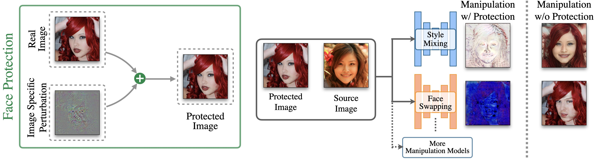

## TAFIM: Targeted Adversarial Attacks for Facial Forgery Detection<br><sub>Official PyTorch implementation of ECCV 2022 paper</sub>



**Targeted Adversarial Attacks for Facial Forgery Detection**<br>
Shivangi Aneja, Lev Markhasin, Matthias Niessner<br>
https://shivangi-aneja.github.io/projects/tafim <br>

Abstract: *Face manipulation methods can be misused to affect an individual’s privacy or to spread disinformation. To this end, we introduce a novel data-driven approach that produces image-specific perturbations which are embedded in the original images. The key idea is that these protected images prevent face manipulation by causing the manipulation model to produce a predefined manipulation target (uniformly colored output image in our case) instead of the actual manipulation. In addition, we propose to leverage differentiable compression approximation, hence making generated perturbations robust to common image compression. In order to prevent against multiple manipulation methods simultaneously, we further propose a novel attention-based fusion of manipulation-specific perturbations. Compared to traditional adversarial attacks that optimize noise patterns for each image individually, our generalized model only needs a single forward pass, thus running orders of magnitude faster and allowing for easy integration in image processing stacks, even on resource-constrained devices like smartphones.*

### Getting started

#### Pre-requisites
- Linux
- NVIDIA GPU + CUDA CuDNN 
- Python 3.X

#### Installation
- Dependencies:  
It is recommended to install all dependecies using `pip`
The dependencies for defining the environment are provided in `requirements.txt`.

### Pre-trained Models
Please download these models, as they will be required for experiments.

| Path                                                                                                                                                                                | Description
|:------------------------------------------------------------------------------------------------------------------------------------------------------------------------------------| :----------
| [pSp Encoder](https://drive.google.com/file/d/1bMTNWkh5LArlaWSc_wa8VKyq2V42T2z0/view?usp=sharing)                                                                                   | pSp trained with the FFHQ dataset for StyleGAN inversion.
| StyleClip                                                                                                                                                                           | StyleClip trained with the FFHQ dataset for text-manipulation ([Afro](https://drive.google.com/uc?id=1i5vAqo4z0I-Yon3FNft_YZOq7ClWayQJ), [Angry](https://drive.google.com/uc?id=1g82HEH0jFDrcbCtn3M22gesWKfzWV_ma), [Beyonce](https://drive.google.com/uc?id=1KJTc-h02LXs4zqCyo7pzCp0iWeO6T9fz), [BobCut](https://drive.google.com/uc?id=1IvyqjZzKS-vNdq_OhwapAcwrxgLAY8UF), [BowlCut](https://drive.google.com/uc?id=1xwdxI2YCewSt05dEHgkpmmzoauPjEnnZ), [Curly Hair](https://drive.google.com/uc?id=1xZ7fFB12Ci6rUbUfaHPpo44xUFzpWQ6M), [Mohawk](https://drive.google.com/uc?id=1oMMPc8iQZ7dhyWavZ7VNWLwzf9aX4C09), [Purple Hair](https://drive.google.com/uc?id=14H0CGXWxePrrKIYmZnDD2Ccs65EEww75), [Surprised](https://drive.google.com/uc?id=1F-mPrhO-UeWrV1QYMZck63R43aLtPChI), [Taylor Swift](https://drive.google.com/uc?id=10jHuHsKKJxuf3N0vgQbX_SMEQgFHDrZa), [Trump](https://drive.google.com/uc?id=14v8D0uzy4tOyfBU3ca9T0AzTt3v-dNyh), [zuckerberg](https://drive.google.com/uc?id=1NjDcMUL8G-pO3i_9N6EPpQNXeMc3Ar1r)  )
| [SimSwap](https://drive.google.com/drive/folders/1ta6CZ_WSXudf7Zp7zw3mrw1QRCTaDD3M?usp=sharinghttps://drive.google.com/drive/folders/1ta6CZ_WSXudf7Zp7zw3mrw1QRCTaDD3M?usp=sharing) | SinSwap trained for face-swapping
| [SAM]()                                                                                         | SAM model trained for age transformation (used in supp. material).
| [StyleGAN-NADA](https://drive.google.com/drive/folders/1Z76nD8pXIL2O5f6xV8VjM4DUCmhbzn0l?usp=sharing)                                                                               | StyleGAN-Nada models (used in supp. material).

### Training models

The code is well-documented and should be easy to follow.
* **Source Code:**   `$ git clone` this repo and install the Python dependencies from `requirements.txt`. The source code is implemented in PyTorch so familarity with PyTorch is expected.
* **Dataset:** We used FFHQ dataset for our experiments. This is publicly available [here](https://github.com/NVlabs/ffhq-dataset). We divide FFHQ dataset into  : Training (5000 images), Validation (1000 images) and Test (1000 images). We additionally used [Celeb-HQ](https://openreview.net/forum?id=Hk99zCeAb) and [VGGFace2-HQ](https://github.com/NNNNAI/VGGFace2-HQ) dataset for some additional experiments. These datasets can be download from the respective websites. All images are resized to 256 X 256 during transform.
* **Manipulation Methods:** We examine our method primarily on three popular manipulations: (1) Style-Mixing using [pSp](https://github.com/eladrich/pixel2style2pixel) (2) Face-Swapping using [SimSwap](https://github.com/neuralchen/SimSwap) and (3) Textual Editing using [StyleClip](https://www.google.com/search?q=styleclip).  This code heavily borrows from these repositories for implementation of these manipulations. Please setup and install dependencies for these methods from their original implementation. The scripts to check whether image manipulation model works can be found in `manipulation_tests/` directory. Make sure that these scripts work and you are able to perform inference on these models.                                 
* **Path Configuration:** Configure the following paths before training. 
  - Refer to `configs/paths_config.py` to define the necessary data paths and model paths for training and evaluation. 
  - Refer to `configs/transforms_config.py` for the transforms defined for each dataset/experiment.
  - Refer to `configs/common_config.py` and change the `architecture_type` and `dataset_type` according to the experiment you wish to perform.
  - Finally, refer to `configs/data_configs.py` for the source/target data paths for the train and test sets as well as the transforms.
  - If you wish to experiment with your own dataset, you can simply make the necessary adjustments in 
      1. `data_configs.py` to define your data paths.
      2. `transforms_configs.py` to define your own data transforms.
  - Refer to `configs/attack_configs.py` and change the `net_noise` to change the protection model architecture.
* **Training:** The main training script to train the protection models for different configurations are directly available in directory `trainer_scripts`. To train the protection models, depending on the manipulation method execute the following commands
```.bash
# For self-reconstruction/style-mixing task
python -m trainer_scripts.train_protection_model_pSp 

# For face-swapping task
python -m trainer_scripts.train_protection_model_simswap

# For textual editing task
python -m trainer_scripts.train_protection_model_styleclip

# For protection against Jpeg Compression
python -m trainer_scripts.train_protection_model_pSp_jpeg

# For combining perturbations from multiple manipulation methods 
python -m trainer_scripts.train_protection_model_all_attention
```


* **Evaluation:**  Once training is complete, then to evaluate, specify the path to protection model and evaulate. For instance, to evaluate for the self reconstruction task for pSp encoder, excecute:
```
    python -m testing_scripts.test_protection_model_pSp -p protection_model.pth
```


</br>

### Citation

If you find our dataset or paper useful for your research , please include the following citation:

```

@inproceedings{aneja2021tafim,
    title={{TAFIM}: Targeted {A}dversarial {A}ttacks against {F}acial {I}mage {M}anipulations}, 
    author={Shivangi Aneja and Lev Markhasin and Matthias Nie{\ss}ner},
    booktitle={ArXiv preprint arXiv:2112.09151},
    year={2021}
}
```

</br>

 Contact Us

If you have questions regarding the dataset or code, please email us at shivangi.aneja@tum.de. We will get back to you as soon as possible.
